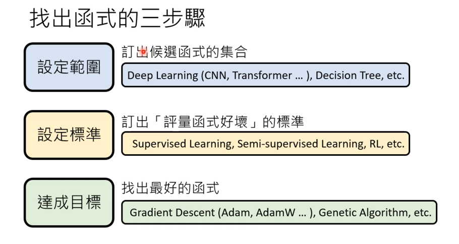

# 生成式ai

https://www.youtube.com/watch?v=yiY4nPOzJEg&list=PLJV_el3uVTsOePyfmkfivYZ7Rqr2nMk3W（生成式AI 2023——李宏毅）

https://www.youtube.com/watch?v=wG8-IUtqu-s（80分钟快速了解大语言模型——李宏毅）

以下内容来自观看 李宏毅老师 Youtube 视频后的总结与思考

ChatGPT：G——Generative（文字接龙）、P——Pre-trained、T——Transformer、其实还有人类微调 Fine-tune

- 大量文本直接进行预训练
- 有监督学习——Question and Answer的pair
- 增强式学习（Reinforcement Learning）——从反馈中学习

在多种语言上做预训练后，只要教某一个语言的某一个任务，生成式ai可以自动学会其他语言的同样任务

### ChatGPT原理剖析

- **文字接龙**：使用者输入，经过函数，映射得到一个输出。x->y，但是这个映射函数是极其复杂的，1700亿以上参数，而且添加了随机性，面对相同输入会得到不同输出（计算下一个生成哪个字的概率比较大，觉得差不多到此为止了就生成句号）
- 会有“**知识幻觉**”，即 一本正经胡说八道，譬如回答根本不存在的网站链接或者确凿地错答知识
- 有的版本下不是联网搜索的“ai”
- “**有监督学习**”——人类给出输入对应的输出，期望机器通过大量的输入输出对自己可以找到一个比较合适的映射，从而对不知道输出的输入也能获得一个比较理想的输出
- parameters 、structure and data
- machine unlearning——防止泄露输入

<!--人为大量地建立知识库可以确保准确性，但这不够general-->

### 简单介绍机器学习基本原理

**机器学习** ≈ 让机器自己去寻找“最好的函数” ，去匹配输入和输出（即便是文生图 、AlphaGo下围棋 也是如此）

**函数的选项集**（即模型model）是人类定义的，并且是非常有限的，机器只是从这个有限集合中不断取函数进行尝试，看哪个拟合得比较好。

**设定衡量函数好坏的标准**（我们称为 **loss function** ，即通过这个function去判断哪个比较好——预测的output都进入loss function，输出这些output的 loss ——可以视作和实际结果的距离啦，我们比较通用的手段就是**gradient decent 、 back propagation** ，通过它们可以去更快地得到“最好的函数”而不必遍历）

**输出 **通常有两种，输出 **值** 或 **类别**（yes or no，label_n。值的问题称为 regression 回归，分类 问题称为classification。（分类问题也可以一样做成值的计算啦，譬如0、1两类，我们有已知的输入输出，如果在已知的输入输出上能找到一个比较好的函数计算输入 得到的输出和实际输出都比较接近，那么我们就可以视作这个函数可以做比较好的分类）

**structured learning** ：生成有结构的东西（影像、语句），又叫生成式学习（Generative Learning）

ChatGPT在做的是 把生成式学习拆成多个分类问题

### 应用

建议大家都Get in AIGC、Build your own GPTs（自定义的 **特制** 知识库）

文本类：

ChatGPT、kimi

文生图：

recraft、Midjourney

图生视频：

可灵

ai生成live实况图流程：

通过大语言模型譬如kimi等，将你的想法翻译为更好的prompt，prompt输入至recraft进行文生图，图片输入可灵生成视频，通过剪映加bgm并转live，截取。